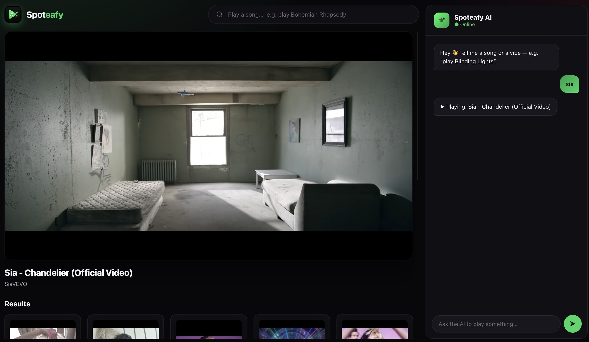

# Spoteafy

Spoteafy is a client and server side YouTube + AI music app that turns natural language requests into song picks. It was originally built in a 7 hour no-AI challenge and includes a real SQLite-backed conversation history.

For your referrence I did this in 4 hours.

## What it does

- Uses Groq to interpret the user’s prompt and refine the search query.
- Searches YouTube Music results and filters out obvious Shorts.
- Embeds the selected video directly in the UI.
- Stores recent conversation history in a local SQLite database.

## Requirements

- Node.js
- pnpm
- A Groq API key
- A YouTube Data API key from Google Cloud Console

## Environment variables

Create a `.env` file with the values expected by the backend:

```env
GROQ_API_KEY=GROQ_API
YOUTUBE_API=YOUTUBE_API
GOOGLE_PATH=https://www.googleapis.com/youtube/v3/
AI_MODEL=GROQ_MODEL
```



## Install

```bash
pnpm install
```

## Run locally

Start the Express API in one terminal:

```bash
pnpm server
```

Start the Vite frontend in another terminal:

```bash
pnpm dev
```

The app will be available at the Vite dev server, and API requests are proxied to the backend on `http://localhost:3001`.

## Notes

- The database is created automatically at `src/database/spoteafy.db`.
- If the AI request fails, the app falls back to the raw query and still searches YouTube.
- The UI is a simple chat-style interface where you can type things like “play Bohemian Rhapsody” or describe a mood.
